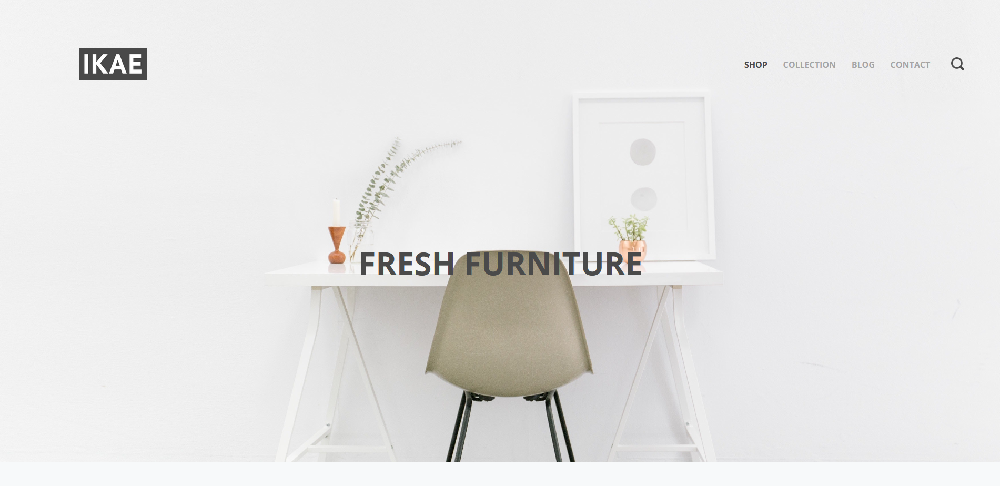
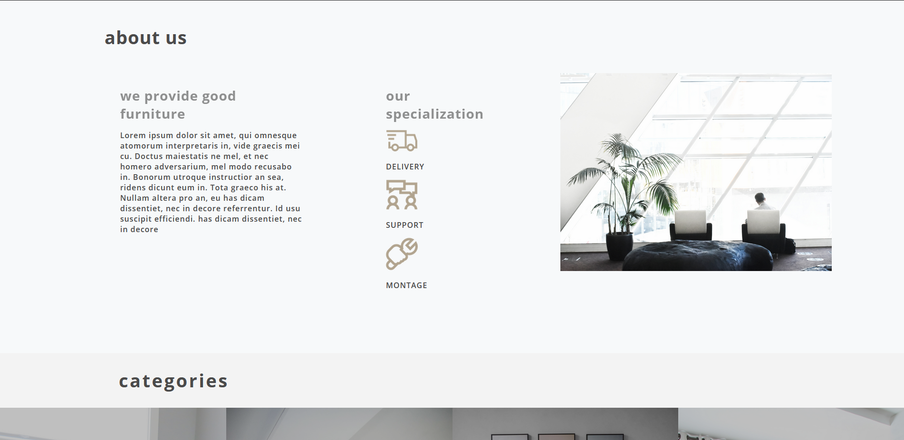
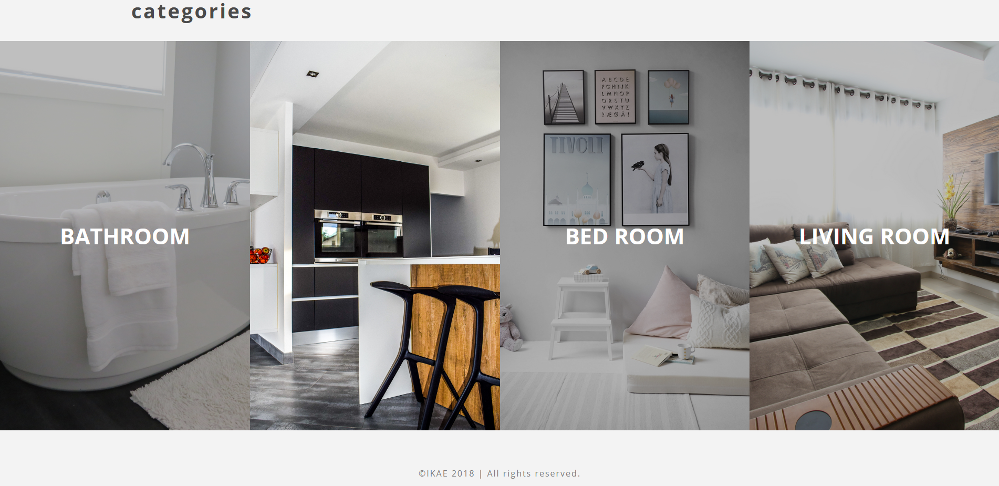
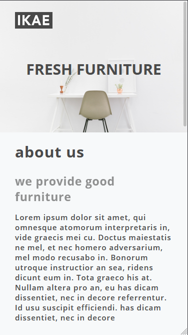
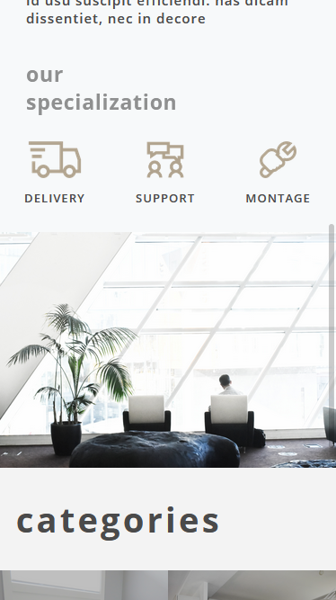
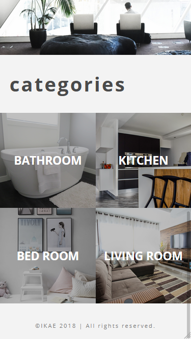

# IKAE
This is a simple responsive landing page made with HTML and CSS.

# Installation
To run this project in your machine, you must clone the repository by running the following command on the command line.

```
git clone https://github.com/Davidhdm/IKAE.git
```

and then run Live Server.

# Desktop Screenshots




# Mobile Screenshots



